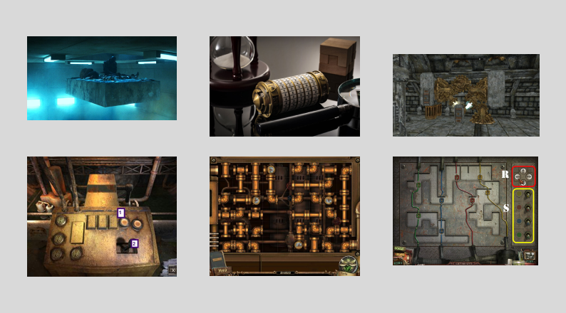
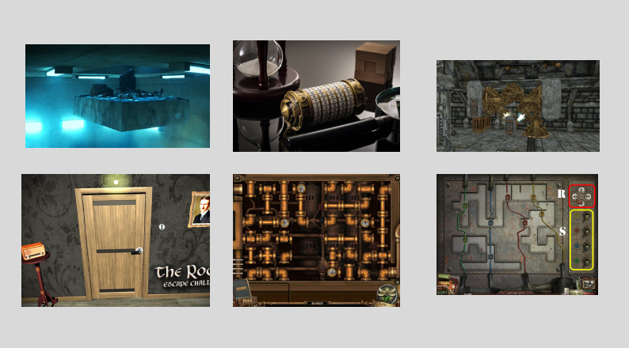

# Un puzzle game avec un ascenseur temporel
En bref, nous commençons dans une salle de viel époque et il y une plateforme en gise d'ascenseur qui nous fait passer d'étage en étage. À chaque étage c'est la même salle mais à une époque différente. Quand nous arrivons à cette pièce nous avons des missions et des énigme qu'il faut résoudre pour que l'ascenseur puise monter.

## Moodboard:

## Environnement virtuel:

